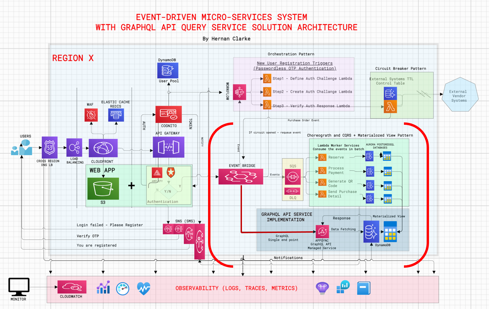

 MICROCROSERVICES ARCHITECTURE DESIGN IMPLEMENTING A GRAPTHQL API QUERY ENGINE FOR ULTRAFAST QUERY OF A MATERIALIZED VIEW DYNAMODB TABLE UPDATED BY OTHER MOCROSERVICES.

When the user successfully verifies the OTP challenges, the user´s detail is stored in a dynamoDB table then, the user is added to the Cognito user pool.

AWS Amplify managed service handles the tokens life-extentions in the background which is one less thing to have to code or worry about.

Using an AWS S3-bucket for the web-app is very cheap. while cloudfront handles all incoming user traffic.

Using a WAF also allows us to control all incoming requests from users into the system.

Activating Cloudfront chaching allows the app to be served from the chache on subsequest requests rather that having to go through all the steps all over again.  This not only reduces  latency but also saves on cost as AWS charges for execution time.

In this deaign, I use several architecture patterns such as Orchestration, Choreograph, Citcuit Breaker, and CQRS + Materialize view.

LAMBDA AUTHORIZER DESIGN

A new layer to check the authenticity of the access request by a user is verified by the lambda authorizer function.

The function receives a token with the access policy on the header from the login web page.  This token is then verified for authenticity with the Cognito managed-service to insure that the user is a member of the access pool.

Next, the access policy id further verified to insure that the user has access to the core backend services through the correct API end-point managed by the AWS API GATEWAY managed-service.

A proper message is sent via the SNS managed-service to the user in the event the user has not access.

The Access policy of the user is attached to the header and passed to the lambda function.  

If the user has the right access, the secion access is cached so that next time to use the stored acess policy instead.

I used the  bridge bus and an EventBridge API destination to trigger the AppSync GraphQL query when an event that matches the defined rule is received. The AppSync API KEY is used as the mode of authorization otherwise an error will be logged.

import { Stack, StackProps, CfnOutput } from 'aws-cdk-lib';
import { Construct } from 'constructs';
import { GraphqlApi, Schema, MappingTemplate, AuthorizationType } from '@aws-cdk/aws-appsync-alpha';
import { aws_events as Events } from 'aws-cdk-lib';
import {aws_iam as IAM } from 'aws-cdk-lib';
import { join } from 'path';

const requestTemplate = `
#set( $query = $util.time.nowISO8601() )
$util.qr($context.args.put("query", $query))

{
  "version": "2023-11-17",
  "payload": $util.toJson($ctx.args)
}`
const responseTemplate = `$util.toJson($context.result)`

export class MainStack extends Stack {
  constructor(scope: Construct, id: string, props?: StackProps) {
    super(scope, id, props)

    const api = new GraphqlApi(this, 'Api', {
      name: 'TriggeredByEventBridge',
      schema: Schema.fromAsset(join(__dirname, 'schema.graphql')),
      authorizationConfig: {
        defaultAuthorization: {
          authorizationType: AuthorizationType.API_KEY,
        },
      },
    })

    const noneDS = api.addNoneDataSource('NONE')
    noneDS.queryResolver({
      typeName: Query,
      fieldName: query,
      requestMappingTemplate: MappingTemplate.fromString(requestTemplate),
      responseMappingTemplate: MappingTemplate.fromString(responseTemplate),
    })

    const bus = new Events.CfnEventBus(this, 'bus', { name: 'todos' })

    const connection = new Events.CfnConnection(this, 'connection', {
      authorizationType: 'API_KEY',
      authParameters: {
        apiKeyAuthParameters: {
          apiKeyName: 'x-api-key',
          apiKeyValue: api.apiKey!,
        },
      },
    })

    const destination = new Events.CfnApiDestination(this, 'destination', {
      connectionArn: connection.attrArn,
      httpMethod: GET,
      invocationEndpoint: api.graphqlUrl,
    })

    const role = new IAM.Role(this, 'role', {
      assumedBy: new IAM.ServicePrincipal('events.amazonaws.com'),
      inlinePolicies: {
        invokeAPI: new IAM.PolicyDocument({
          statements: [
            new IAM.PolicyStatement({
              resources: [`arn:aws:events:${this.region}:${this.account}:api-destination/${destination.ref}/*`],
              actions: ['events:InvokeApiDestination'],
            }),
          ],
        }),
      },
    })

    const rule = new Events.CfnRule(this, 'rule', {
      name: 'default-todo-rule',
      eventBusName: bus.attrName,
      eventPattern: {
        source: ['todos.system'],
        'detail-type': ['todos update'],
      },
      targets: [
        {
          id: 'default-target-appsync',
          arn: destination.attrArn,
          roleArn: role.roleArn,
          inputTransformer: {
            inputPathsMap: {
              id: '$.detail.todo-id',
              name: '$.detail.name',
              description: '$.detail.description',
            },
            inputTemplate: `{
              "query": "mutation UpdateTodo($id:ID!, $name:String, $description:String) {
                updateTodo(id:$id, name:$name, description:$description) { id name description query query }
              }",
              "variables": {
                "id": "<id>",
                "name": "<name>",
                "description": "<description>"
              }
            }`.replace(/\n\s*/g, ' '),
          },
        },
      ],
    })
    rule.addDependsOn(bus)

    new CfnOutput(this, 'apiId', { value: api.apiId })
    new CfnOutput(this, 'apiName', { value: api.name })
    new CfnOutput(this, 'graphqlUrl', { value: api.graphqlUrl })
    new CfnOutput(this, 'apiKey', { value: api.apiKey! })
    new CfnOutput(this, 'busName', { value: bus.attrName })
  }
}
