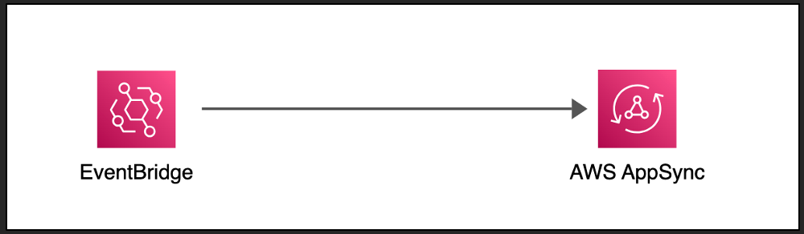

ECOMMERCE CLOUD MICROCROSERVICES ARCHITECTURE DESIGN

The goal is to let the System Architecture design abosrve the complexity of the system while keeping the code simple, always observice the single responsibility pattern.

When the user successfully verify the OTS challenges, the user detail is stored in a dynamoDB table and the user is added to Cognito user pool.

I am using amplify for simplicity!  Also amplify handles the token life extention process in the background.  One less thing to have to code or worry about.

Using an S3 bucket for the web app is very cheap. while cloudfront handles the incoming traffic from the users.

Using a WAF also allows us to control all incoming requests from users into the system.

Activating Cloudfront chaching rules allows the app to be served from the chache on subsequest requests rather that having to go through the steps all over again.

In this deaign, I use several architecture patterns such as Orchestration, Choreograph, and CQRS + Materialize view.

Note: There are still  several additional critical global services to be added as part of the overall software design architecture for this system, such as loggin, monitoring, security, etc.

LAMBDA AUTHORIZER DESIGN

A new layer to check the authenticity of the access request by a user is verified by the lambda authorizer function.

The function receives a token with the access policy on the header from the login web page.  This token is then verified for authenticity with the Cognito managed-service to insure that the user is a member of the access pool.

Next, the access policy id further verified to insure that the user has access to the core backend services through the correct API end-point managed by the AWS API GATEWAY managed-service.

A proper message is sent via the SNS managed-service to the user in the event the user has not access.

The Access policy of the user is attached to the header and passed to the lambda function.  

If the user has the right access, the secion access is cached so that next time to use the stored acess policy instead.